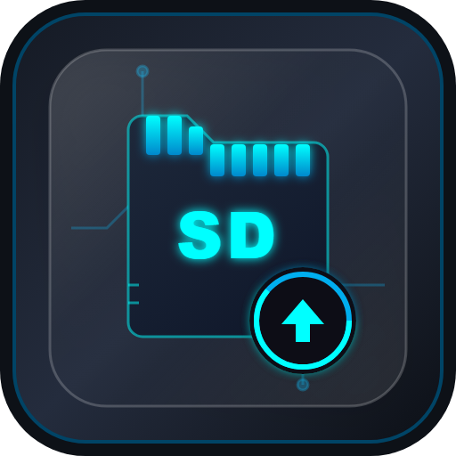

# Switch SD Card Manager (v7.2.0)

<p align="center">
  
</p>

> A portable desktop Switch SD card, Boot Bin output, and SSH environment manager built for **Windows**, **macOS**, and **Linux** systems.

Created by: **Roy Dawson IV**  
GitHub: [https://github.com/ImYourBoyRoy](https://github.com/ImYourBoyRoy)  
PyPi: [https://pypi.org/user/ImYourBoyRoy/](https://pypi.org/user/ImYourBoyRoy/)

---

## Use Case Synopsis

**Switch SD Card Manager** is a premium, high-fidelity desktop workspace utility designed to safely configure, update, and manage your Nintendo Switch environment. Whether your SD card is mounted directly, prepared in a local staging folder, or updated remotely via SSH while plugged into your console, this tool provides full modular control.

### Core Capabilities:
- **Smart Queue Checking**: Seamlessly separates installed files, updates available, and uninstalled sources from your custom catalog.
- **Smart Phased Installs**: Employs structural dependencies to prioritize CFW architectures (Atmosphere first, Hekate second, then standard packages).
- **SSH Remote Operations**: Recursive package pushing and real-time remote configuration updates over network connections.
- **Boot Bin Output**: Automated payload mirroring utilizing naming templates such as `{folder}/payload.bin`.
- **Config Doctor & Schema Creator**: Real-time structured config auditing, creation wizards (template, managed defaults, or empty), and structural/raw file diff previews with backups.
- **Removable Media Shield**: Passive storage targets tracking, fast eject integrations, and active workspace integrity verifications.

---

## Premium Utilities Suite

The application includes a state-of-the-art **Utilities** suite with five diagnostic, conversion, and hardware tools:

1. **Bootlogo Customizer (HTML5 Canvas Encoder)**
   * Drag-and-drop custom image droppable panel.
   * Auto-crops and centers your image to the standard Switch boot screen resolution of exactly `720x1280` pixels.
   * Compiles uncompressed 32-bit ARGB/BGRA bitmap byte files and writes them directly to Hekate's `/bootloader/bootlogo.bmp` target.
2. **Security Shield (Telemetry Tester)**
   * Performs static audits on on-card Atmosphere `/hosts/default.txt` and `/hosts/emummc.txt` blocklists.
   * Executes a live network DNS resolution check to verify that Nintendo tracking endpoints are safely sinkholed.
3. **Storage Benchmark & Authenticity Guard**
   * Writes a 20MB mock data sequence to a temp file, flushes filesystem caches, and benchmarks write throughput.
   * Reads the blocks back to measure read throughput and computes Sha256 signatures to **immediately detect counterfeit/fake SD expander cards**.
4. **Emulation Doctor (BIOS Hash Auditor)**
   * Scans `/retroarch/cores/system/` on your card for console system bios.
   * Calculates MD5 checksums and audits them against official console databases for PlayStation 1 (US), Game Boy Advance, Sega Dreamcast, and PlayStation 2.
5. **RCM Payload Injection Guide**
   * High-fidelity, interactive step-by-step instructions walking newcomers through hardware recovery triggers (RCM) and USB payload injection tools.

---

## Standalone Building & Automation Pipeline

This project features a fully automated, local portable release compilation and smoke-testing pipeline available for all three desktop platforms.

### Windows (PowerShell Builder)
Compile, bundle, and package the portable Windows distribution:
```powershell
# Standard Portable Release Build
powershell -ExecutionPolicy Bypass -File .\scripts\build.ps1

# Clean Compile (cargo clean + packaging)
powershell -ExecutionPolicy Bypass -File .\scripts\build.ps1 -Mode Clean

# Full Production Release Build + Smoke Test Verification
powershell -ExecutionPolicy Bypass -File .\scripts\build.ps1 -Mode Smoke
```

### macOS & Linux (Unix Bash Sibling)
Configure and bundle the portable distribution locally on Apple Silicon / Intel macOS or Linux environments:
```bash
# 1. Give executable permissions to the script
chmod +x ./scripts/build.sh

# 2. Build the standard Unix portable distribution
./scripts/build.sh

# 3. Compile in clean mode
./scripts/build.sh --mode clean

# 4. Compile and run structural smoke-test assertions
./scripts/build.sh --mode smoke
```

---

## Verified Outputs

### Windows `build.ps1 -Mode Smoke` Output
```text
> switch-sd-mgr@7.0.0 build
> tsc && vite build

vite v8.0.14 building client environment for production...
transforming...✓ 1770 modules transformed.
dist/assets/index-CWkbXhWS.css   28.76 kB │ gzip:  6.03 kB
dist/assets/index-CoArwf7O.js   325.06 kB │ gzip: 93.87 kB
✓ built in 1.02s

   Compiling switch-sd-mgr v7.0.0 (C:\Users\Roy\Desktop\SD\06_SD_Updater_3-26-2026\src-tauri)
   Compiling md5 v0.7.0
    Finished `release` profile [optimized] target(s) in 10m 17s
       Built application at: C:\Users\Roy\Desktop\SD\06_SD_Updater_3-26-2026\src-tauri\target\release\switch-sd-mgr.exe
[SUCCESS] Portable workspace created at C:\Users\Roy\Desktop\SD\06_SD_Updater_3-26-2026\build_portable
--- Portable smoke test ---
[SUCCESS] Portable smoke test passed.
```

### macOS / Linux `build.sh --mode smoke` Output
```text
--- Syncing branding icon assets ---
--- Cleaning build outputs ---
--- Building portable SD Manager workspace ---
npm run build
npm run tauri build
[SUCCESS] Portable workspace created at /Users/Roy/Desktop/SD/06_SD_Updater_3-26-2026/build_portable
--- Running portable smoke test ---
[SUCCESS] Portable smoke test passed successfully.
```

---

## Commands & Arguments

The Tauri desktop binary also supports standard terminal commands for CLI-based checks and sync routines:

| CLI Command | Action / Responsibility |
| :--- | :--- |
| `cargo run -- check` | Scan workspace configurations and fetch newest updates metadata. |
| `cargo run -- update --all` | Download and extract all queued upgrades onto active SD target. |
| `cargo run -- sync` | Sync local overrides inside `Custom_stuff/` into your active target. |

---

## Project Layout

A structured high-level overview of the Switch SD Manager codebase directories:

```text
├── .github/                # Automation workflows (GitHub CI/CD Release runners)
├── build/                  # Repository local build seeds
│   ├── configs/            # Configuration seed files (config.json, sources.json, etc.)
│   └── Custom_stuff/       # Custom user post-install override files seed
├── icons/                  # High-quality branding logo artwork pngs and ico files
├── scripts/                # Local pipeline scripts
│   ├── build.ps1           # Windows PowerShell release packaging script
│   ├── build.sh            # macOS & Linux Bash release packaging script
│   └── Clear-Cache.ps1     # Intermediate build cache purger script
├── src/                    # React 19 Frontend Code (TypeScript + Tailwind styling)
│   ├── components/         # Shared visual components and dialog modals
│   ├── hooks/              # Domain-specific states encapsulations (useSources, useWorkspace, etc.)
│   ├── utils/              # Frontend formatting libraries
│   └── views/              # Modular major tab panes (Dashboard, Updates, Configs, Utilities, etc.)
└── src-tauri/              # Rust 2024 Backend Crate
    ├── src/
    │   ├── commands/       # Decoupled command controllers (ssh.rs, paths.rs, utilities.rs, etc.)
    │   ├── core/           # Main packaging engines (downloader, config manager, storage detect)
    │   └── lib.rs          # Central Tauri State definitions and handler registries
    └── Cargo.toml          # Rust package dependencies and standard parameters
```

---

## Developer Operations

Launch the local development environment with hot-reloading active:
```bash
# Install NPM dependencies
npm install

# Start the Vite + Tauri hot-reloading dev environment
npm run tauri dev
```

Run test suites:
```powershell
# Windows
powershell -ExecutionPolicy Bypass -File .\scripts\Run-Tests.ps1

# Cross-platform
cargo test --lib --manifest-path src-tauri/Cargo.toml
```
